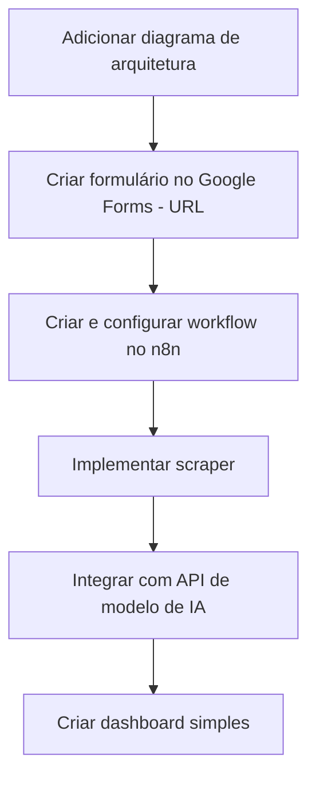

# Monitor de Preços
## Sobre o Projeto
**Projeto:**
Grupo 6 - Monitor de Preços  
**Problema que resolve:**
O projeto tem o objetivo de analisar e identificar as melhores opotunidades de preço para um determinado produto
## Integrantes
| Nome | GitHub |
|------|--------|
| Joao Guilherme Amadei Simao (RA: 26022239) | @joaoggg434 |
| Lucas Bertola da Silva (RA: 22005810) | @Srsups |
| [Nome 3] | [@usuario3] |
## Arquitetura

