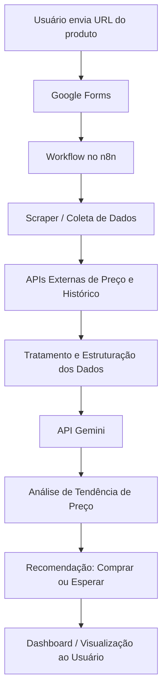

# Monitor de Preços
## Sobre o Projeto
**Projeto:**
Grupo 6 - Monitor de Preços  
**Problema que resolve:**
O projeto tem o objetivo de analisar e identificar as melhores opotunidades de preço para um determinado produto
## Integrantes
| Nome | GitHub |
|------|--------|
| Joao Guilherme Amadei Simao (RA: 26022239) | @joaoggg434 |
| Lucas Bertola da Silva (RA: 22005810) | @Srsups |
| Maria Luiza Daon (RA: 26024438) | @MariaDaon |
## Arquitetura

```mermaid
flowchart TD

    A["Usuário envia URL do produto"] --> B["Google Forms"]

    B --> C["Workflow no n8n"]

    C --> D["Scraper / Coleta de Dados"]

    D --> E["APIs Externas de Preço e Histórico"]
    E --> F["Tratamento e Estruturação dos Dados"]

    F --> G["API Gemini"]

    G --> H["Análise de Tendência de Preço"]
    H --> I["Recomendação: Comprar ou Esperar"]

    I --> J["Dashboard / Visualização ao Usuário"]
```

## Como funciona

O usuário informa ao sistema o produto que deseja monitorar e um preço-alvo para esse produto. Após receber essas informações, o sistema realiza o processamento consultando o preço atual do item e comparando esse valor com o preço-alvo definido pelo usuário. Como saída, o sistema retorna um resultado de sucesso caso o preço atual esteja abaixo do preço-alvo, indicando uma boa oportunidade de compra, ou um resultado de fracasso caso o preço esteja acima do valor desejado.
