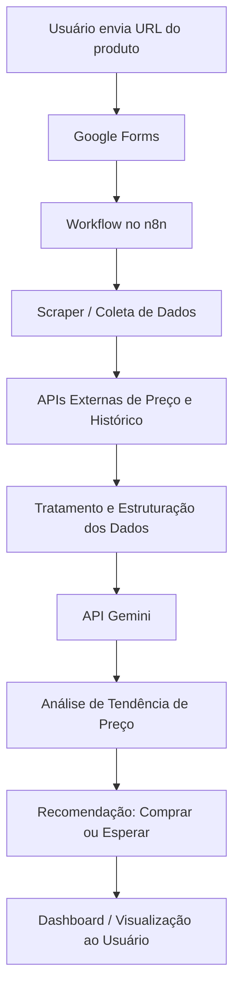

# Monitor de Preços
## Sobre o Projeto
**Projeto:**
Grupo 6 - Monitor de Preços  
**Problema que resolve:**
O projeto tem o objetivo de analisar e identificar as melhores opotunidades de preço para um determinado produto
## Integrantes
| Nome | GitHub |
|------|--------|
| Joao Guilherme Amadei Simao (RA: 26022239) | @joaoggg434 |
| Lucas Bertola da Silva (RA: 22005810) | @Srsups |
| Maria Luiza Daon (RA: 26024438) | @MariaDaon |
## Arquitetura

```mermaid
flowchart TD

    A["Usuário envia URL do produto"] --> B["Google Forms"]

    B --> C["Workflow no n8n"]

    C --> D["Scraper / Coleta de Dados"]

    D --> E["APIs Externas de Preço e Histórico"]
    E --> F["Tratamento e Estruturação dos Dados"]

    F --> G["API Gemini"]

    G --> H["Análise de Tendência de Preço"]
    H --> I["Recomendação: Comprar ou Esperar"]

    I --> J["Dashboard / Visualização ao Usuário"]
```

## Como funciona

O usuário informa um produto e um preço desejado. O sistema consulta uma API externa para obter o preço atual e compara com o valor informado. Caso o preço esteja abaixo do esperado, retorna uma mensagem de oportunidade de compra. Caso contrário, informa que o preço ainda não é ideal.
